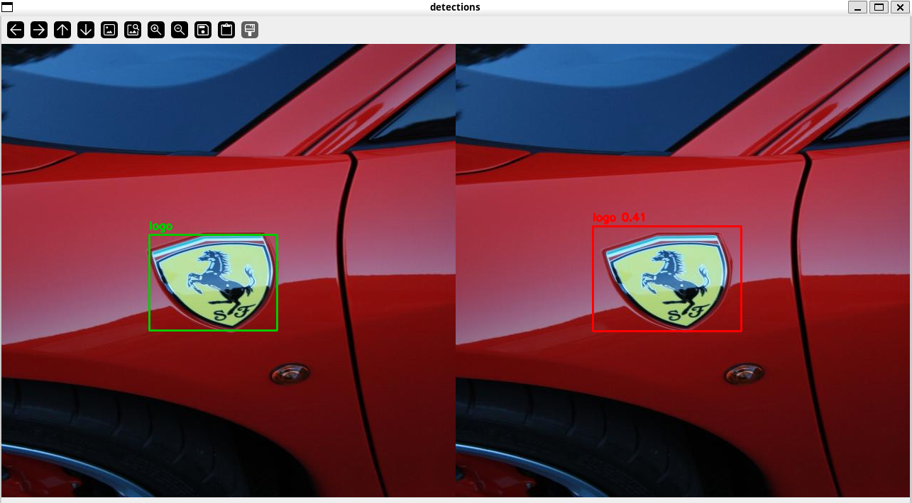
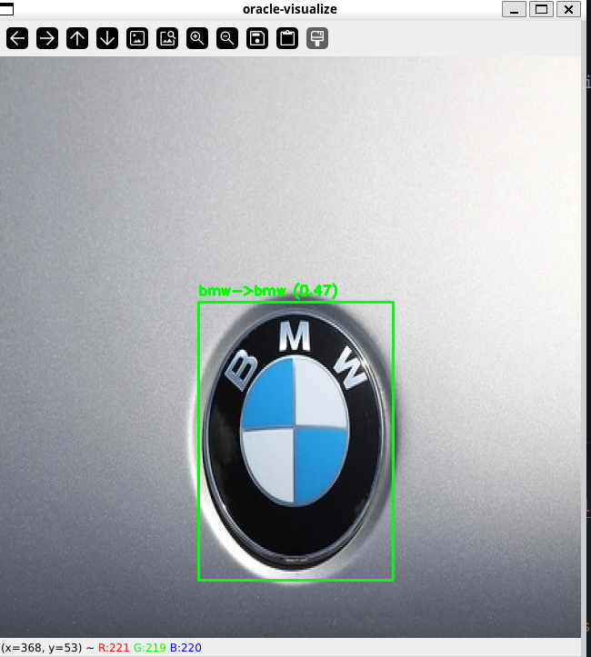
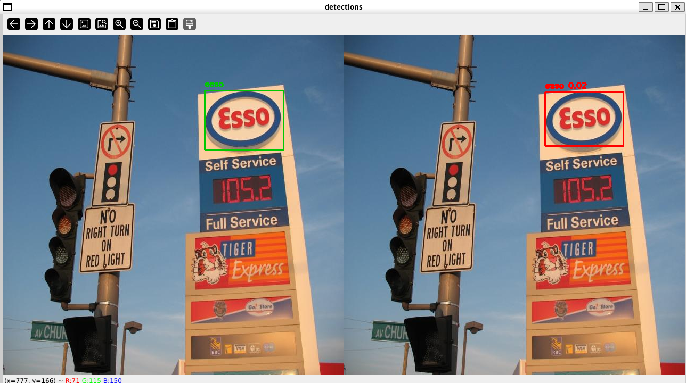

# Logo detector clásico (OpenCV + SVM)

Proyecto de visión por computador 100% clásico: generamos propuestas con MSER/contornos/gradientes, filtramos logo vs fondo con un SVM lineal y clasificamos con un SVM multiclase (BoW + HSV + HOG). No hay redes neuronales; todo se apoya en OpenCV y un par de SVMs. Los artefactos (vocabulario, modelos, estadísticas) se guardan en `models/` y todo se maneja desde un CLI único.

Para preparar datos, entrenar o ver la arquitectura con más detalle, entra en `logo_detector/README.md`.

## Cómo lanzar el CLI principal
```bash
python main.py          # menú interactivo (detectar / clasificar / pipeline)
```
```bash
# o subcomandos directos
python main.py detect 5 --mser-preset balanced --show
python main.py oracle-classify --split test
python main.py detect 0 --image data/test/ejemplo.jpg --mser-preset strict --show
```

## Detección (logo/no-logo)
Comando de ejemplo:
```bash
python main.py detect 5 --mser-preset balanced --show
```



## Clasificación (usando cajas GT)
Comando de ejemplo:
```bash
python main.py oracle-classify --split test
```



## Pipeline completo (detección + clasificación)
Comando de ejemplo:
```bash
python main.py detect 0 --image data/test/ejemplo.jpg --mser-preset strict --show
```



En caso de querer ir paso a paso (prep de datos, entrenamiento, ajustes finos), sigue las instrucciones técnicas en `logo_detector/README.md`.